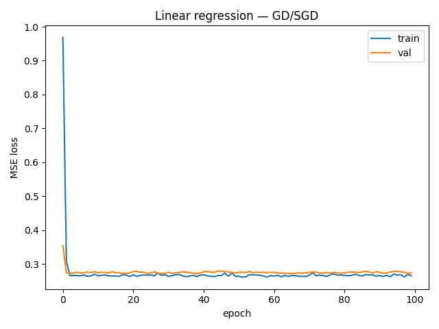
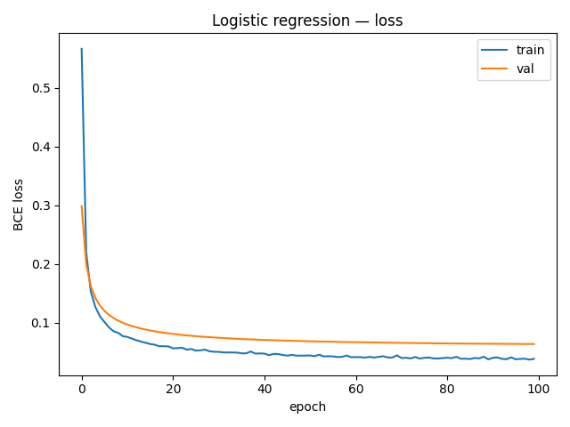
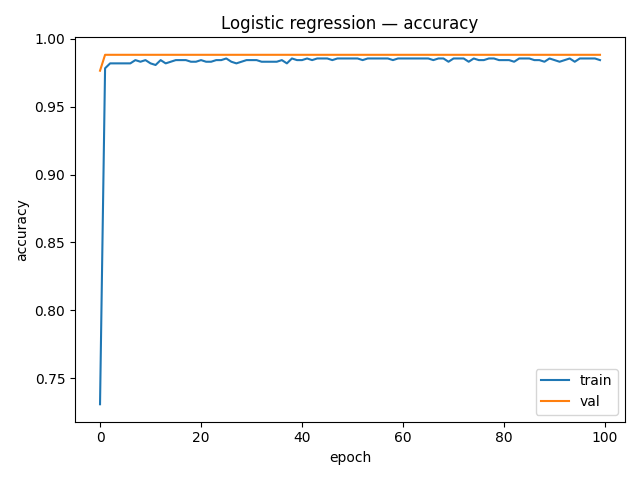

# Logistic Regression (GLM)\nLink: https://en.wikipedia.org/wiki/Logistic_regression\n\n## Why it matters\n- TODO\n\n## Key ideas / math\n- TODO\n\n## Implementation plan\n- [ ] Dataset: TODO\n- [ ] Components: TODO\n- [ ] Training / loss: TODO\n- [ ] Metrics: TODO\n\n## Run\n```bash\npython -m src.train --config configs/default.yaml\n```\n# Foundations: Linear & Logistic Regression

This subproject implements **linear regression** and **logistic regression** from scratch
using PyTorch, focusing on:

- gradient descent (GD) vs stochastic gradient descent (SGD)
- synthetic regression and classification datasets
- training/validation loss curves
- basic evaluation (MSE for regression, accuracy for classification)

## Results — Linear Regression (Synthetic Data)

Config:

- n_samples = 1000
- n_features = 5
- noise_std = 0.5
- optimizer = SGD
- lr = 0.05
- epochs = 100

Final run:

```text
train_loss ≈ 0.265  |  val_loss ≈ 0.273  |  best_val ≈ 0.272

## Results — Logistic Regression (Binary Data)

Config:

Synthetic 2D Gaussian blobs

Optimizer: SGD (lr = 0.1)

Loss: BCEWithLogits

Epochs: 100

Batch size: 64

Final run:


```text
train_acc = 0.984
val_acc   = 0.988
best_val  = 0.988





## Key Insights from Linear & Logistic Regression (Foundations)

- **Linear regression** minimizes squared error and has a *closed-form solution*,  
  but gradient descent/SGD provide scalable alternatives when data becomes large.

- **Logistic regression** models log-odds with a linear boundary; despite its
  simplicity, it's a powerful baseline for binary classification.

- **Gradient descent vs SGD**:
  - GD gives smooth, stable convergence (entire dataset per update)
  - SGD introduces noise, often helping faster exploration early
  - SGD scales to large datasets and is used in all modern deep networks

- These models form the conceptual basis for:
  - Neural network output layers (linear layer → logits)
  - Loss functions (MSE, cross-entropy)
  - Optimization intuition (GD, SGD, weight decay)
  - The geometry of decision boundaries

This section helps recruiters understand that I have a strong foundation
underneath my deep-learning knowledge.

## How to run

From repo root:

```bash
cd foundations/linear_models

# create and activate venv (or reuse top-level one)
python -m venv .venv
.\.venv\Scripts\activate

pip install -r ../../requirements.txt
