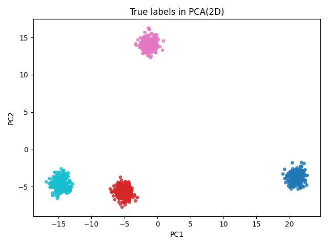
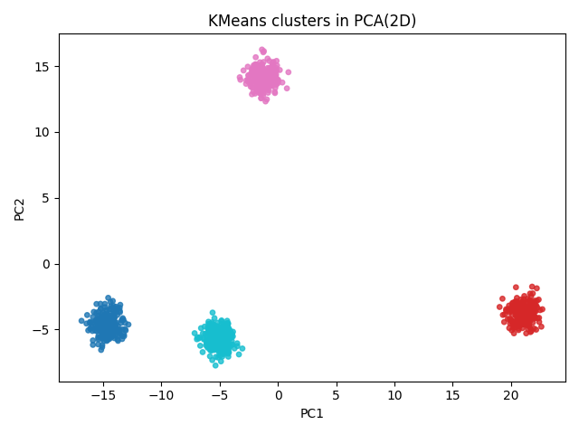

# Foundations: PCA & k-means

This subproject implements **Principal Component Analysis (PCA)** and
**k-means clustering** from scratch on synthetic data.

It demonstrates:

- how PCA finds directions of maximum variance
- how much variance the first few components explain
- how k-means behaves in the original vs PCA-transformed space
- visualizations of clusters in 2D after PCA

---

## PCA Visualizations

### True labels in PCA 2D


### k-means clusters in PCA 2D


## How to run

From repo root:

```bash
cd foundations/pca_kmeans

# (optional) activate your root venv
# D:\Machine_Learning\ml-portfolio-all-papers> .\venv\Scripts\activate
# or create a local one:
# python -m venv .venv
# .\.venv\Scripts\activate

pip install -r ../../requirements.txt
