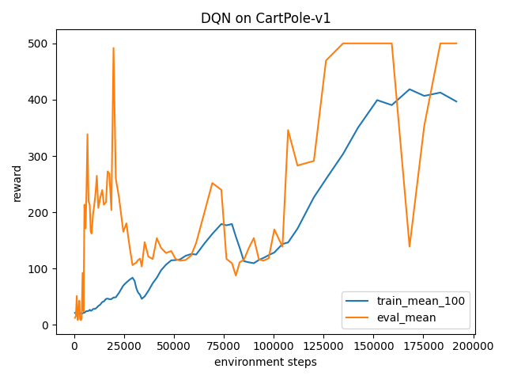

# Deep Q-Network (DQN) – CartPole-v1

This subproject implements **Deep Q-Network (DQN)**, inspired by:

> Mnih et al., "Human-level control through deep reinforcement learning", Nature 2015.

To keep it lightweight, we apply DQN to `CartPole-v1` instead of Atari,
but keep the key algorithmic ideas:

- Q-network parameterizing Q(s, a)
- Experience replay buffer
- Target network for stable bootstrapping
- ε-greedy exploration with linear decay

---

## How to run

From repo root:

```bash
cd rl/dqn

# (optional) activate root venv
# D:\Machine_Learning\ml-portfolio-all-papers> .\venv\Scripts\activate

pip install -r ../../requirements.txt
pip install gymnasium[classic-control]
## Results – DQN on CartPole-v1

Baseline config (`configs/cartpole_dqn.yaml`):

- Env: `CartPole-v1` (gymnasium)
- Q-network: 2-layer MLP (`hidden_dim = 128`)
- Optimizer: Adam (`lr = 1e-3`)
- Discount factor: γ = 0.99
- Replay buffer: 50,000 transitions
- Batch size: 64
- Start training after: 1,000 steps
- Train frequency: every 4 steps
- Target network update: every 1,000 steps
- Exploration: ε-greedy  
  - ε decays linearly from 1.0 → 0.05 over 50k steps

After one training run, the agent learns to balance the pole reliably.


```text
Max train mean_100 reward: ~412.6
Max eval mean reward:      ~500
Total env steps:           191548

### Learning Curve


