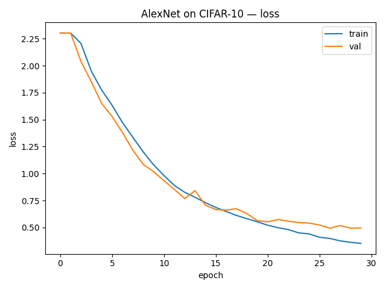
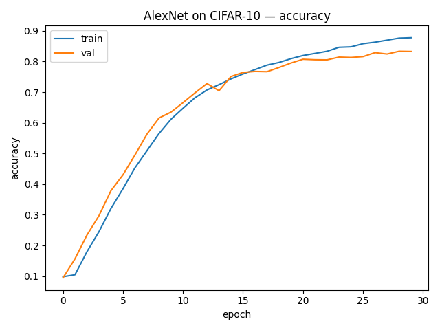

# AlexNet (Krizhevsky et al., 2012) — CIFAR-10 Implementation

**Paper:** ImageNet Classification with Deep Convolutional Neural Networks  
**Authors:** Alex Krizhevsky, Ilya Sutskever, Geoffrey Hinton (2012)  
**Link:** https://dl.acm.org/doi/10.1145/3065386

---

## Why this paper matters

- First large-scale CNN to **win ImageNet** and trigger the deep learning revolution.
- Introduced:
  - Deep 5-convolution-layer architecture
  - **ReLU** non-linearities
  - Heavy **data augmentation**
  - **Dropout** in fully-connected layers
- Paved the way for later architectures like VGG, GoogLeNet, and ResNet.

---

## Implementation details

This project implements an **AlexNet-style model for CIFAR-10**:

- Input: RGB `3×32×32`
- Conv stack:
  - 5 conv layers, with intermediate max-pooling
  - Channels: 64 → 192 → 384 → 256 → 256
  - Activation: ReLU
- Fully-connected head:
  - 4096 → 4096 → 10
  - **Dropout(0.5)** between FC layers

Adaptation notes:

- The original paper used `224×224` inputs and large 11×11/stride-4 kernels.
- For CIFAR-10 (small images), we use 3×3 kernels and no initial stride-4 pooling, keeping the **depth and style** of AlexNet but making it suitable for 32×32 images.

---

## Training setup

- Dataset: **CIFAR-10**
- Split: 90% train / 10% validation from train set
- Augmentation:
  - RandomCrop(32, padding=4)
  - RandomHorizontalFlip
  - Normalize with CIFAR-10 mean/std
- Loss: `CrossEntropyLoss`
- Optimizer (baseline): **SGD + momentum**
  - `lr = 0.01`
  - `momentum = 0.9`
  - `weight_decay = 5e-4`
- Batch size: `128`
- Epochs: `30`
- Device: auto (CUDA if available, otherwise CPU)

Config: `configs/default.yaml`.

---

### Training Curves




## Results

Baseline config:

- Model: AlexNet (CIFAR-10 variant)
- Optimizer: SGD with momentum (`lr = 0.01`, `momentum = 0.9`)
- Weight decay: `5e-4`
- Batch size: `128`
- Epochs: `30`
- Device: CUDA (RTX 3060) / CPU fallback

Final run:

```text
[epoch 30] train_acc=0.878  val_acc=0.833  best_val=0.833


## How to run

From the repo root:

```bash
cd vision/alexnet

# create & activate venv (Windows)
python -m venv .venv
.\.venv\Scripts\activate

# install shared requirements
pip install -r ../../requirements.txt
