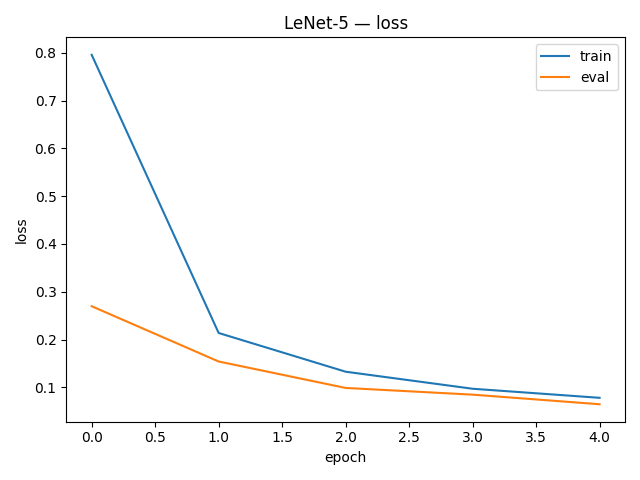
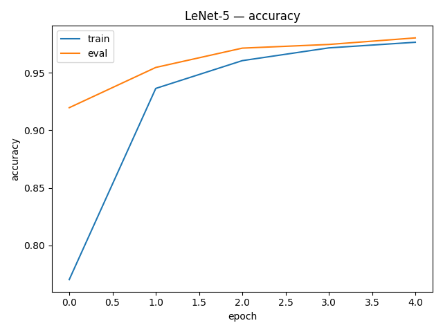

# LeNet-5 (LeCun et al., 1998) — MNIST Implementation

**Paper:** Gradient-Based Learning Applied to Document Recognition  
**Authors:** Yann LeCun et al., 1998  
**Link:** http://yann.lecun.com/exdb/lenet/

---

## Why this paper matters

- One of the earliest successful **convolutional neural networks** for vision.
- Introduced the classic pattern: `Conv → Nonlinearity → Pooling → Fully Connected`.
- Historically important for handwritten digit recognition (MNIST) and a perfect
  “hello world” CNN for an ML engineering portfolio.

---

## Implementation details

### Model

LeNet-5 (simplified connectivity):

- C1: `Conv2d(1 → 6, kernel=5, stride=1, padding=2)`  → 28×28
- S2: `AvgPool2d(2×2)` → 14×14
- C3: `Conv2d(6 → 16, kernel=5, stride=1)` → 10×10
- S4: `AvgPool2d(2×2)` → 5×5
- C5: `Conv2d(16 → 120, kernel=5, stride=1)` → 1×1
- F6: `Linear(120 → 84)`
- Output: `Linear(84 → 10)`
- Activation: **Tanh** after each conv / FC layer (matching the paper).

> Note: the original paper used **partial connectivity** in C3.  
> Here it is simplified to full convolution (standard in modern LeNet implementations).

### Training setup

- Dataset: **MNIST** (60k train, 10k test)
- Input: grayscale `1×28×28`
- Loss: `CrossEntropyLoss`
- Optimizer: **SGD with momentum**
  - learning rate: `0.01`
  - momentum: `0.9`
  - weight decay: `5e-4`
- Batch size: `128`
- Epochs: `5`
- Device: **CPU** (PyTorch CPU build)

Configuration lives in: `configs/default.yaml`.

---

## Results

Training run:

```text
[epoch 5] train_acc=0.977  eval_acc=0.980  best=0.980

## Training Curves

### Loss


### Accuracy


