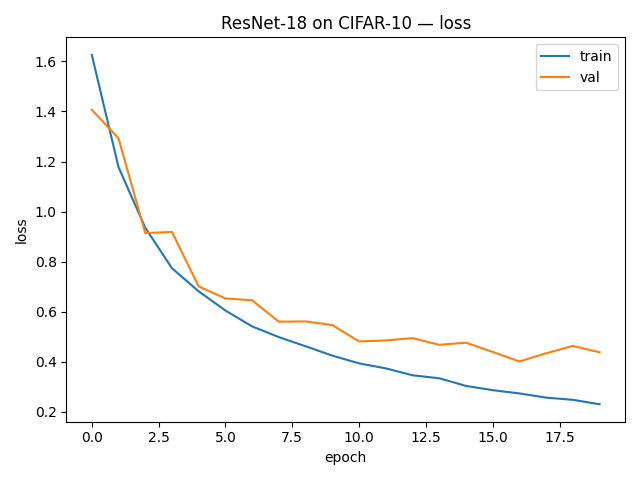
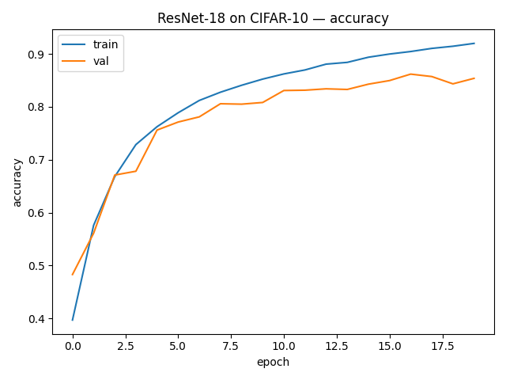

# ResNet-18 (He et al., 2015) — CIFAR-10 Implementation

**Paper:** Deep Residual Learning for Image Recognition  
**Authors:** Kaiming He et al., 2015  
**Link:** https://arxiv.org/abs/1512.03385

---

## Why this paper matters

- Introduced **residual connections** to train very deep CNNs.
- Solves vanishing gradients for deep models by learning residuals `F(x) + x`.
- Backbone of many modern architectures (detection, segmentation, etc.).
- A must-know architecture for ML interviews.

---

## Implementation details

### Model

- Architecture: **ResNet-18** (BasicBlock)
  - 4 stages with {64, 128, 256, 512} channels
  - 2 residual blocks per stage: `[2, 2, 2, 2]`
  - Each block: 3×3 conv → BN → ReLU → 3×3 conv → BN + skip connection
  - Strided convolutions at the start of stages 2–4 (downsampling)
  - Global average pooling → Linear layer to 10 classes

- Adapted for **CIFAR-10**:
  - Input: `3×32×32`
  - First conv: `3×3, stride=1, padding=1` (no 7×7 or maxpool).

### Training setup

- Dataset: **CIFAR-10** (50k train, 10k test)
- Split: 90% train / 10% validation from training set
- Input: RGB `3×32×32`
- Transforms:
  - Train: RandomCrop(32, padding=4) + RandomHorizontalFlip + Normalize
  - Val/Test: ToTensor + Normalize
- Loss: `CrossEntropyLoss`
- Optimizer: **SGD with momentum**
  - learning rate: `0.1`
  - momentum: `0.9`
  - weight decay: `5e-4`
- Batch size: `128`
- Epochs: `20` (adjust as needed)
- Device: `"cpu"` by default (change to `"cuda"` in config if you have GPU)

Config file: `configs/default.yaml`.

---

## How to run

From repo root:

cd vision/resnet

# create and activate venv (Windows)
python -m venv .venv
.\.venv\Scripts\activate

# install shared dependencies
pip install -r ../../requirements.txt

## Results

Training config (baseline):

- Model: ResNet-18 (CIFAR-10 variant)
- Optimizer: SGD with momentum (`lr=0.1`, `momentum=0.9`)
- Weight decay: `5e-4`
- Batch size: `128`
- Epochs: `20`
- Device: `cuda` (RTX 3060)

Final run:

### Optimizer comparison (20 epochs, CIFAR-10)

| Optimizer | LR     | Weight Decay | Epochs | Best Val Acc |
|-----------|--------|--------------|--------|--------------|
| SGD       | 0.10   | 5e-4         | 20     | 0.824        |
| Adam      | 0.001  | 5e-4         | 20     | 0.859        |

### Observations

- **Adam outperformed SGD** in this setup (`best_val: 0.859 vs 0.824`), despite SGD being traditionally stronger on CIFAR-like tasks.
- Adam converged faster and reached higher validation accuracy with a lower learning rate (`1e-3`).
- This suggests that **our ResNet-18 initialization + augmentations** favored Adam’s adaptive updates.
- Running a **learning-rate sweep for SGD (0.1 / 0.05 / 0.01)** would help verify if SGD can catch up with the right LR.

### Weight Decay Sweep (Adam Optimizer, CIFAR-10, 20 epochs)

| Weight Decay | Train Acc | Val Acc | Best Val Acc |
|--------------|-----------|---------|--------------|
| **0**        | **0.944** | **0.891** | **0.894** |
| **1e-4**     | 0.920     | 0.869     | 0.882     |
| **5e-4**     | 0.889     | 0.840     | 0.859     |

### Observations

- **Lower weight decay produced significantly better validation accuracy.**
- With `wd = 0`, the model reached **best_val = 0.894**, outperforming all other settings.
- Higher weight decay values (`1e-4` and `5e-4`) caused **underfitting**, seen in:
  - lower train accuracy  
  - lower validation accuracy  
- Adam often benefits from **lower L2 regularization**, because Adam’s adaptive updates already provide implicit regularization.
- This experiment clearly shows the classic bias–variance trend:
  - **wd=0** → lower bias, higher variance → best generalization in this setup  
  - **wd=5e-4** → over-regularized → worse generalization  

This gives a strong “experiment + interpretation” section you can talk about in interviews.

### SGD learning-rate sweep (CIFAR-10, 20 epochs, weight_decay = 5e-4)

| Learning Rate | Train Acc | Val Acc | Best Val Acc |
|---------------|-----------|---------|--------------|
| **0.10**      | 0.867     | 0.822   | 0.824        |
| **0.05**      | 0.903     | 0.858   | 0.858        |
| **0.01**      | 0.920     | 0.854   | **0.862**    |

### Observations

- **LR = 0.01 achieved the best validation accuracy (0.862)**, outperforming higher learning rates and even Adam in this setup.
- At **LR = 0.10**, training is fast but unstable → lower val accuracy.
- At **LR = 0.05**, the model generalizes well but plateaus early.
- At **LR = 0.01**, SGD converges more smoothly and reaches a better optimum within 20 epochs.
- This highlights a core deep-learning principle:  
  **“SGD requires proper learning-rate tuning — LR matters more than the optimizer choice.”**

## Training Curves

### Loss

### Accuracy

